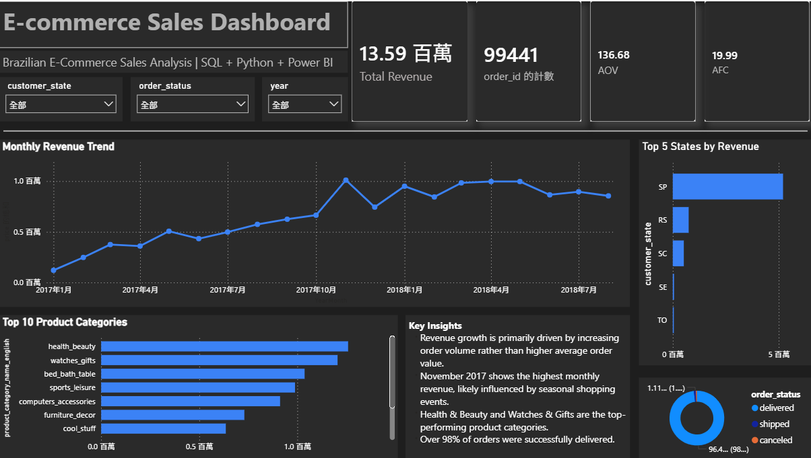

# E-Commerce Sales Dashboard

## Project Objective

Build an end-to-end business intelligence project using SQL, Python, SQLite, and Power BI to analyze e-commerce revenue trends, product performance, regional sales distribution, and order fulfillment status.

---

## Tools

- SQL (SQLite)
- Python
- pandas
- Power BI

---

## Dataset

Dataset: Olist Brazilian E-Commerce Dataset  
Source: Kaggle

---

## Business Questions

- What are the major revenue trends over time?
- Which product categories contribute the most revenue?
- Is revenue growth driven more by order volume or average order value?
- Which customer states contribute the most revenue?
- What is the overall order delivery performance?

---

## Dashboard Preview




## Key Analysis

### Monthly Revenue Trend

- Revenue peaked in 2017-11
- MoM growth reached 52.10%
- Growth was mainly driven by increased order volume

### Product Category Analysis

- health_beauty generated the highest revenue
- computers had the highest average order value
- Unknown category contributed low revenue percentage

---

## Project Structure

```
data/        -> raw CSV dataset
sql/         -> SQL analysis scripts
scripts/     -> Python scripts for loading and running queries
dashboard/   -> Power BI dashboard and preview image
notebooks/   -> optional analysis notebooks
```